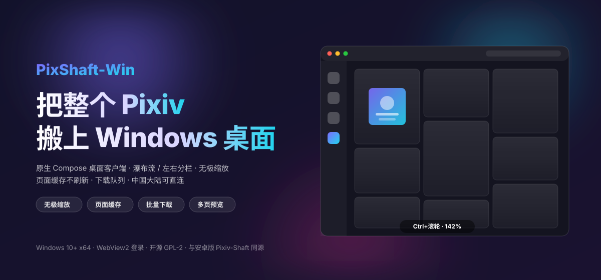

<div align="center">

<a href="https://github.com/normalwindow/Pixiv-Shaft-Win" title="PixShaft-Win">
  
</a>

<br>

[](https://github.com/normalwindow/Pixiv-Shaft-Win/releases)
[](https://github.com/normalwindow/Pixiv-Shaft-Win/stargazers)
[](./LICENSE)

<sub>Windows 10+ x64 · Kotlin + Compose Multiplatform 原生桌面客户端 · 免费开源 · 无广告</sub>

**简体中文** | [English](#english) · Android 版请回到上游 [CeuiLiSA/Pixiv-Shaft](https://github.com/CeuiLiSA/Pixiv-Shaft)

</div>

> [!NOTE]
> 这是一个非官方的第三方 [Pixiv](https://www.pixiv.net) 客户端，fork 自 [CeuiLiSA/Pixiv-Shaft](https://github.com/CeuiLiSA/Pixiv-Shaft) 的 `classic` 分支。所有插画、漫画、小说作品版权归各自创作者与 Pixiv 所有；本项目开源仅供学习交流使用。

---

## 这是什么

**PixShaft-Win** 是 Pixiv-Shaft（安卓端知名第三方 Pixiv 客户端）的 **Windows 桌面分支**：
上游的安卓 App 保持原样继续跟随上游更新，本仓库在 `classic` 分支上另起一条
`desktop/` 模块，用 **Kotlin + Compose Multiplatform** 写了一个原生的 Windows 客户端——
不是网页套壳，也不是 Electron，就是一个普通的 Win32 进程 + GPU 渲染的 Compose 界面。

登录走系统 WebView2（与 Pixeval 相同的方案），网络默认**中国大陆可直连**
（Chromium QUIC + 无 SNI 图片通道），无需代理。

## 与上游（安卓版）的差异

| | 上游安卓 App | 本仓库桌面端 |
|---|---|---|
| 平台 | Android 7.0+ | Windows 10+ x64 |
| 技术栈 | View + XML（classic 分支） | Compose Multiplatform 桌面 |
| 侧栏 | 底部栏 / 平板侧栏 | 可隐藏悬停展开侧栏（60dp 窄条 → 196dp 浮层，不推挤内容） |
| 浏览 | 单列跳转 | 瀑布流跳转 / 左右分栏（中缝一键左右互换） |
| 缩放 | 固定列数 | **Ctrl+滚轮 / 双指捏合无极缩放**（40%–300%，带百分比标尺与一键复位） |
| 页面连贯性 | 返回重载 | 页面数据 + 滚动位置缓存，进出详情页、切换页签不刷新 |
| 排行 | 19 种榜单 + 日期 | 同样 19 种榜单 + 日期选择器（与上游对齐） |
| 关注 | 全部/公开/私人 | 插画·漫画 / 小说 × 全部/公开/私人 |
| 搜索 | 完整筛选 | 历史 + 发现 + 排序/匹配/收藏数/R-18 筛选（持久化） |
| 图片预览 | 应用内查看器 | 全窗口预览：滚轮缩放、拖动平移、多页翻页、Esc 关闭 |
| 下载管理 | Service + 通知 | 队列页：暂停/继续、单任务重试/移除、失败批量重试、打开文件夹 |
| 快捷键 | 少量 | `Ctrl+F` 搜索、`Esc` 返回、`1–5` 切换页签、方向键翻页预览 |

上游安卓 App 的功能与截图见 [上游 README](https://github.com/CeuiLiSA/Pixiv-Shaft#readme)。

## 桌面端功能

- **首页**：推荐（插画/漫画）+ 实时热门标签条 + 一键刷新
- **排行**：日/周/月/AI/男性/女性/原创/新人/R-18 系列/R-18G/漫画系列，共 19 种榜单，可选日期回看历史榜单
- **关注**：插画·漫画与小说双流，全部/公开/私人三档
- **搜索**：搜索历史（本地保存、可清空）+ 搜索发现（热门标签、排行速览），结果页内置排序 / 匹配方式 / 收藏数下限 / R-18 四组筛选
- **作品详情**：多 P 页签（页码胶囊 + 缩略图条）、动图自动播放、漫画阅读器、相关作品一键进瀑布流、收藏/下载/关注全联动（自动关注、自动下载、私密收藏等设置全部生效）
- **用户页**：插画 / 漫画 / 关注（收藏）三页签 + 关注按钮
- **下载**：文件名模板、按作者/R18/AI 分目录、覆盖策略、并发数、本地队列管理
- **其它**：多账号、以图搜图、网络自检、FANBOX、pixiv COMIC、本地小说、本地书库、深色模式、5 种强调色

## 下载安装

到 [GitHub Releases](https://github.com/normalwindow/Pixiv-Shaft-Win/releases) 下载：

| 文件 | 说明 |
|---|---|
| `PixShaft-x.y.z.msi` | Windows 安装包（推荐），带开始菜单与卸载项 |
| `PixShaft-x.y.z.exe` | 同上的 EXE 安装包 |
| `PixShaft-x.y.z-portable.zip` | 便携版，解压即用，数据与程序同目录 |

首次启动后在登录页用 **WebView2 登录**（需要系统装有 WebView2 Runtime，Win11 自带）。

## 从源码构建

```bat
git clone https://github.com/normalwindow/Pixiv-Shaft-Win.git
cd Pixiv-Shaft-Win
set JAVA_HOME=C:\path\to\jdk-17
gradlew.bat :desktop:packageReleaseDistributionForCurrentOS
```

- 需要 **JDK 17**；`gradle.properties` 里保留了上游作者的 macOS 工具链路径，
  在其它机器上构建请通过 `JAVA_HOME` 指向本地 JDK 17，或用
  `-Dorg.gradle.java.installations.paths=` 覆盖。
- 产物在 `desktop/build/compose/binaries/main-release/` 下（`msi/`、`exe/`、`zip/`、`app/`）。
- 只想跑起来看效果：`gradlew.bat :desktop:run`。

## 键盘快捷键

| 按键 | 作用 |
|---|---|
| `Ctrl+F` / `4` | 打开搜索 |
| `1` / `2` / `3` / `5` | 首页 / 排行 / 关注 / 我的 |
| `Esc` | 关闭预览 / 搜索 / 抽屉 / 分栏详情，否则返回上一页 |
| `←` / `→` | 图片预览中翻页 |
| `Ctrl+滚轮` | 瀑布流无极缩放 |

## 截图

| | |
|---|---|
|  |  |
|  |  |
|  |  |

## 目录结构

```
app/            上游安卓 App（保持上游原样，跟随 classic 分支）
shared/         双端共享：Pixiv App-API 客户端、模型、OAuth
desktop/        Windows 桌面端（本项目主要开发处）
  ui/           Compose 界面：导航、瀑布流、详情、预览、设置…
  net/          网络诊断
  webview-auth/ WebView2 登录辅助进程（.NET 8）
docs/           协议与架构笔记（含聊天 WS 协议、feeds 模块等，来自上游）
```

## 与上游同步

本仓库 `classic` 分支直接跟踪上游 `classic`；上游提交会定期合并进来，
`shared/` 与 `app/` 尽量不做破坏性改动以保证可合并性。桌面端代码全部位于
`desktop/` 与 `shared/` 的少量增量里。

## 免责声明

本项目与 Pixiv 官方无关。请遵守 Pixiv 服务条款，尊重创作者版权，
下载功能仅用于个人离线欣赏。

## License

[GPL-2.0](./LICENSE)（继承上游）

## 致谢

- [CeuiLiSA/Pixiv-Shaft](https://github.com/CeuiLiSA/Pixiv-Shaft) —— 一切的基础
- [Pixeval](https://github.com/Pixeval/Pixeval) —— WebView2 登录方案的参考
- [JetBrains Compose Multiplatform](https://github.com/JetBrains/compose-multiplatform)、[Coil](https://github.com/coil-kt/coil)、[OkHttp](https://github.com/square/okhttp)、[Retrofit](https://github.com/square/retrofit)

---

<a id="english"></a>

<div align="center">

<a href="https://github.com/normalwindow/Pixiv-Shaft-Win">
  
</a>

**PixShaft-Win** — a native Windows client for Pixiv, grown out of the
Android app [CeuiLiSA/Pixiv-Shaft](https://github.com/CeuiLiSA/Pixiv-Shaft).
Kotlin + Compose Multiplatform, direct connection in mainland China,
free & open source. See the Chinese section above for the full feature list.

</div>
