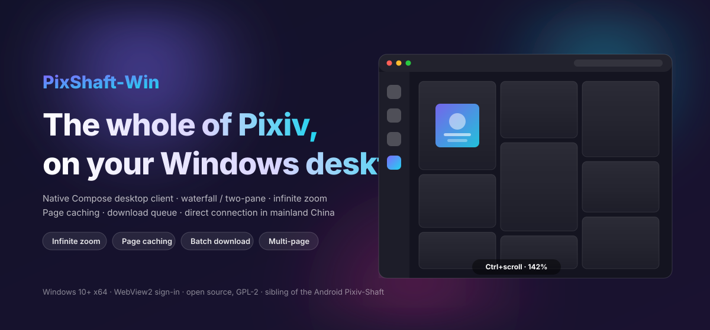
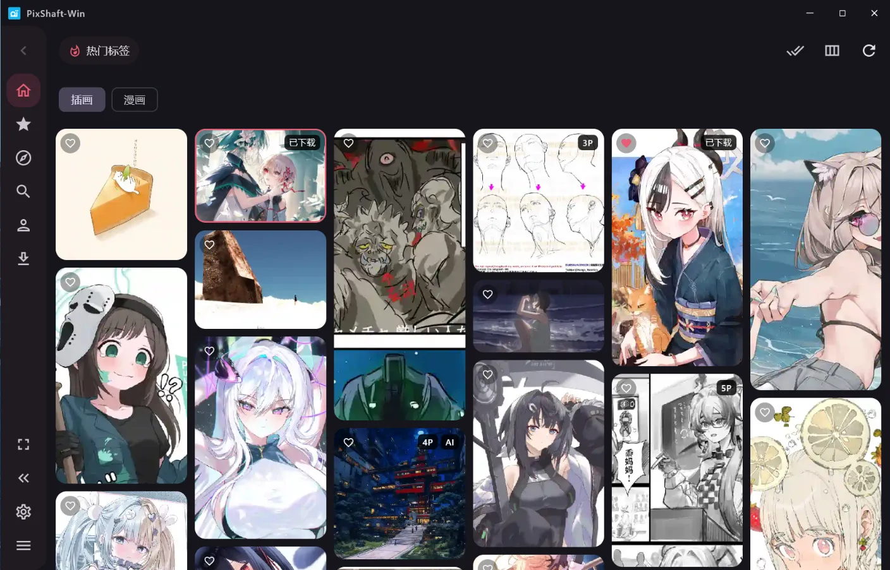
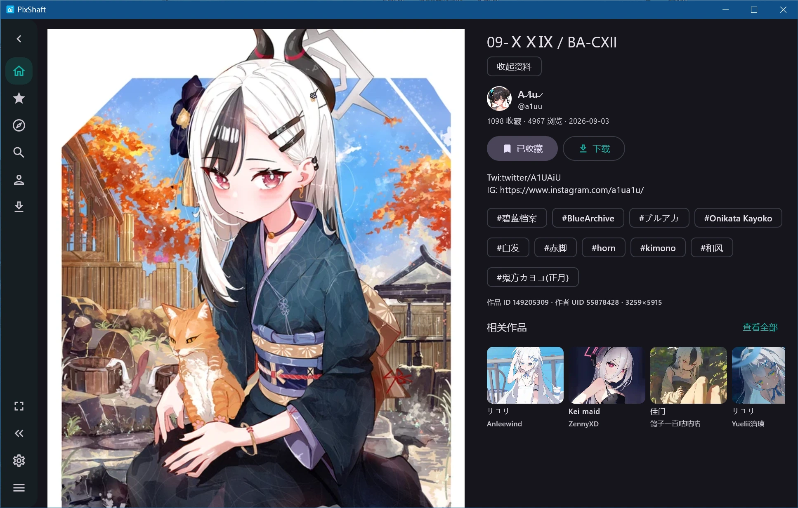
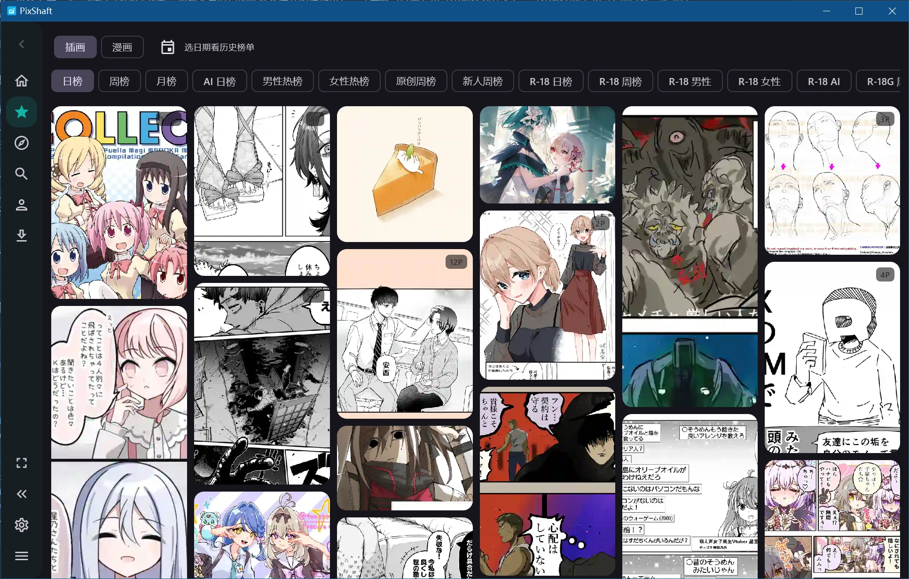
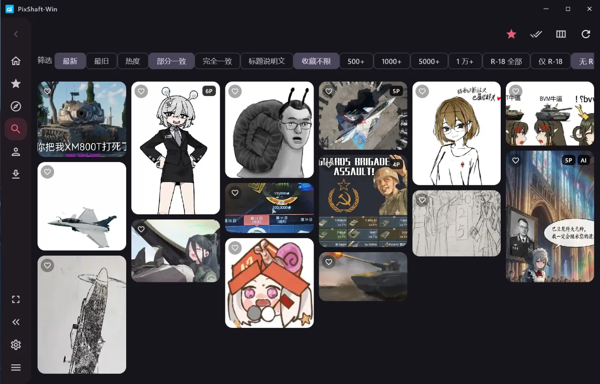
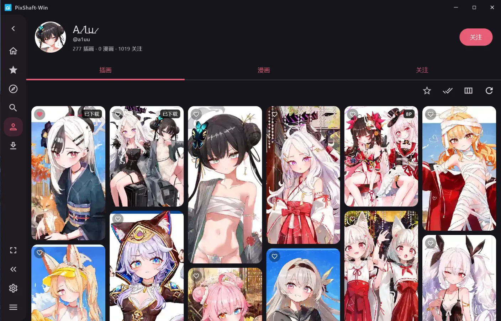
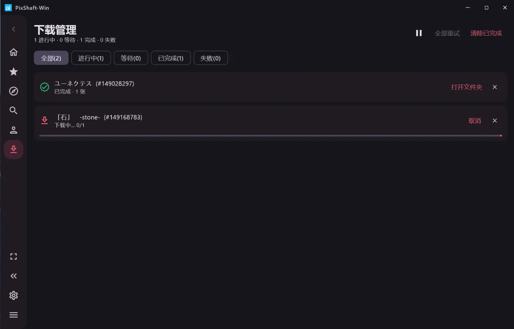

<div align="center">

<a href="https://github.com/normalwindow/Pixiv-Shaft-Win">
  
</a>

<br>

[](https://github.com/normalwindow/Pixiv-Shaft-Win/releases)
[](https://github.com/normalwindow/Pixiv-Shaft-Win/stargazers)
[](../LICENSE)

<sub>Windows 10+ x64 · Kotlin + Compose Multiplatform · 無料 · オープンソース · 広告なし</sub>

[简体中文](../README.md) · [English](README.en.md) · **日本語**

Android 版は上流の [CeuiLiSA/Pixiv-Shaft](https://github.com/CeuiLiSA/Pixiv-Shaft) へ。

</div>

> [!NOTE]
> 非公式のサードパーティ [Pixiv](https://www.pixiv.net) クライアントです。[CeuiLiSA/Pixiv-Shaft](https://github.com/CeuiLiSA/Pixiv-Shaft)（`classic` ブランチ）のフォーク。作品の権利は各作者および Pixiv に帰属します。学習・交流目的のみ。

---

## これは何

**PixShaft-Win** は、有名なオープンソース Android Pixiv クライアント「Pixiv-Shaft」の **Windows デスクトップ版**です。上流の Android アプリは `classic` ブランチでそのまま維持され、本リポジトリは `desktop/` モジュールとして **Kotlin + Compose Multiplatform** 製のネイティブ Windows クライアントを追加しました。Web の包みでも Electron でもなく、普通の Win32 プロセス + GPU 描画の Compose UI です。

ログインはシステムの WebView2（Pixeval と同じ方式）。ネットワークは中国本土で**直接接続**が既定です（Chromium QUIC + 無 SNI 画像経路）。プロキシは不要です。

## 上流（Android 版）との違い

| | 上流 Android | 本デスクトップ |
|---|---|---|
| プラットフォーム | Android 7.0+ | Windows 10+ x64 |
| 技術 | View + XML（classic） | Compose Multiplatform デスクトップ |
| サイドバー | ボトムバー / タブレット側欄 | ホバーで展開（60dp → 196dp 浮層、コンテンツは動かない） |
| 閲覧 | 単一ペイン | 瀑布流ジャンプ / 左右ツーペイン（中央で入れ替え） |
| ズーム | 固定列数 | **Ctrl+ホイール / ピンチで無段階ズーム**（40%–300%、定規とリセット付き） |
| ページ状態 | 戻ると再読込 | データ + スクロール位置をキャッシュ。詳細の出入りやタブ切替で再読込しない |
| ランキング | 19 種 + 日付 | 同じく 19 種 + カレンダー |
| フォロー | すべて/公開/非公開 | イラスト·漫画 / 小説 × すべて/公開/非公開 |
| 検索 | 完全なフィルタ | 履歴 + 発見 + 並び/一致/ブックマーク数/R-18（永続化） |
| 画像プレビュー | アプリ内ビューア | 全画面：ホイール拡大、ドラッグ移動、複数枚、Esc で閉じる |
| ダウンロード | Service + 通知 | キュー：一時停止/再開、個別リトライ/削除、フォルダを開く |
| ショートカット | 少ない | `Ctrl+F` 検索、`Esc` 戻る、`1–5` タブ、矢印でプレビュー送り |

上流 Android の機能とスクリーンショットは [上流 README](https://github.com/CeuiLiSA/Pixiv-Shaft#readme) を参照。

## デスクトップ機能

- **ホーム**：おすすめ（イラスト/漫画）+ リアルタイムトレンドタグ + ワンタップ更新
- **ランキング**：日/週/月/AI/男性/女性/オリジナル/新人/R-18 系/R-18G/漫画など 19 種。日付を選んで過去ランキングも見られる
- **フォロー**：イラスト·漫画と小説の二系統、すべて/公開/非公開
- **検索**：履歴（ローカル保存、消去可）+ 発見（トレンドタグ、ランキング速覧）。結果ページに並び / 一致 / ブックマーク下限 / R-18 の四組フィルタ
- **作品詳細**：複数枚ページャ、うごイラ自動再生、漫画リーダー、関連作品のページ送り瀑布流、コメント閲覧と投稿、ブックマーク/ダウンロード/フォロー連動
- **ユーザー**：イラスト / 漫画 / ブックマーク。スクロールで作者情報を縮め、フォローボタン付き
- **精华列（ピン留め列）**：検索 / 作者 / フォロー / 関連 / ランキングなどを列として保存。再起動後も残り、カードをクリックするだけで開く
- **ダウンロード**：ファイル名テンプレート、作者/R18/AI 別フォルダ、上書き方針、同時数、キュー管理。ピン留め列から一括でキューへ入れられる
- **その他**：複数アカウント、画像検索、ネットワーク自己診断、FANBOX、pixiv COMIC、ローカル小説、ローカル文庫、ダークモード、アクセントカラー、自前タイトルバー

## インストール

[GitHub Releases](https://github.com/normalwindow/Pixiv-Shaft-Win/releases) から入手：

| ファイル | 説明 |
|---|---|
| `PixShaft-Win-x.y.z.msi` | Windows インストーラ（推奨）。スタートメニューとアンインストール付き |
| `PixShaft-Win-x.y.z.exe` | 同じインストーラの EXE |
| `PixShaft-Win-x.y.z-portable.zip` | ポータブル。データは実行ファイルと同じ場所 |

初回起動時に **WebView2** でログインします（WebView2 Runtime が必要。Windows 11 は標準搭載）。

## ビルド

```bat
git clone https://github.com/normalwindow/Pixiv-Shaft-Win.git
cd Pixiv-Shaft-Win
set JAVA_HOME=C:\path\to\jdk-17
gradlew.bat :desktop:packageReleaseDistributionForCurrentOS
```

**JDK 17** が必要です。`gradle.properties` には上流作者の macOS ツールチェーンパスが残っています。別マシンでは `JAVA_HOME` をローカル JDK 17 に向けるか、`-Dorg.gradle.java.installations.paths=` で上書きしてください。成果物は `desktop/build/compose/binaries/main-release/`。とりあえず動かすだけなら `gradlew.bat :desktop:run`。

## キーボードショートカット

| キー | 動作 |
|---|---|
| `Ctrl+F` / `4` | 検索 |
| `1` / `2` / `3` / `5` | ホーム / ランキング / フォロー / 自分 |
| `Esc` | プレビュー / 検索 / ドロワー / 分割詳細を閉じる。なければ戻る |
| `←` / `→` | 画像プレビューでページ送り |
| `Ctrl+ホイール` | 瀑布流の無段階ズーム |

## スクリーンショット

| | |
|---|---|
|  |  |
|  |  |
|  |  |

## ディレクトリ構成

```
app/            上流 Android アプリ（classic をそのまま追跡）
shared/         共有：Pixiv App-API クライアント、モデル、OAuth
desktop/        Windows デスクトップ（本プロジェクトの主戦場）
  ui/           Compose UI：ナビ、瀑布流、詳細、プレビュー、設定…
  net/          ネットワーク診断
  webview-auth/ WebView2 ログイン補助（.NET 8）
docs/           上流由来のプロトコル / アーキテクチャメモ
```

## 上流との同期

本リポジトリの `classic` は上流 `classic` を追跡します。上流コミットは定期的に取り込み、`shared/` と `app/` は破壊的変更を避けてマージしやすくしています。デスクトップ側のコードは `desktop/` と `shared/` の少量の増分にあります。

## 免責

本プロジェクトは Pixiv 公式とは無関係です。Pixiv の利用規約を守り、作者の著作権を尊重してください。ダウンロードは個人のオフライン閲覧のみを想定しています。

## License

[GPL-2.0](../LICENSE)（上流より継承）

## 謝辞

- [CeuiLiSA/Pixiv-Shaft](https://github.com/CeuiLiSA/Pixiv-Shaft) — すべての土台
- [Pixeval](https://github.com/Pixeval/Pixeval) — WebView2 ログインの参考
- [Compose Multiplatform](https://github.com/JetBrains/compose-multiplatform) · [Coil](https://github.com/coil-kt/coil) · [OkHttp](https://github.com/square/okhttp) · [Retrofit](https://github.com/square/retrofit)
